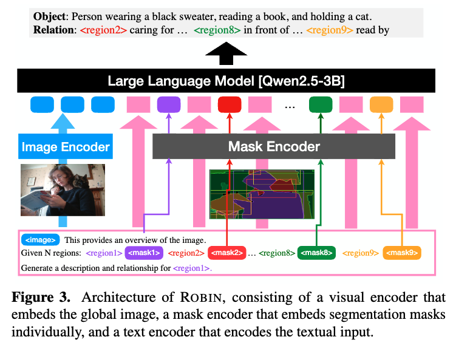

<!-- <div align=center>
 [](https://arxiv.org/pdf/2312.10032.pdf) [](https://huggingface.co/datasets/AntGroup-MI/Osprey-724K) [](https://youtu.be/YsxqHBBnDfk) [](http://111.0.123.204:8000/) 
</div>


---

<!-- <div align=center>

</div> -->


## Synethic Visual Genome [SVG]  🎨
**Synthetic Visual Genome**:
the first **automatically generated large-scale scene graph** dataset with diverse open-set categories, fine-grained regions, and densely annotated **relationships**.

<div align=center>

</div>


<!-- **Synthetic Visual Genome** is a large-scale dataset for with gpt4 filled out scene graphs.

Our Relation-Object instruction tuned model **Robin-3b** can use [SAM](https://github.com/facebookresearch/segment-anything) in point-prompt, box-prompt and segmentation everything modes to generate the semantics associated with specific parts or objects. -->

<!--  -->

## Related Resources 🔗

- **Website**: [link](https://synthetic-visual-genome.github.io/)
- **Paper**: [arxiv](https://arxiv.org/abs/2506.07643)
- **Demo** (Coming soon): 
  <div align=center>
</img>
</div>

## Updates 📌
 **[2025/06/10]**: 🔥🚀 Initial release of Synthetic Visual Genome with inferen code for [ROBIN-3B](https://huggingface.co/jamepark3922/robin-qwen2.5-3b), and [SVG dataset release](https://huggingface.co/datasets/jamepark3922/svg).


## Installation 🛠️
Clone this repository and navigate to **SyntheticVG folder**.
```
git clone https://github.com/jamespark3922/SyntheticVG.git
cd SyntheticVG
```
Install packages
```
conda create -n svg python=3.10 -y
conda activate svg
pip install --upgrade pip  # enable PEP 660 support
pip install -e .
```
Install flash attention for training cases
```
pip install flash-attn==2.6.3 --no-build-isolation
```

## Dataset 🌟

You can download the syntheticv visual genome (SVG) dataset from Hugging Face Datasets:
- SVG Dataset: [🤗 hf-dataset](https://huggingface.co/datasets/jamepark3922/svg)
  - SVG Relations: [link](https://huggingface.co/datasets/jamepark3922/svg/tree/main/relations)
  - SVG SG: [link](https://huggingface.co/datasets/jamepark3922/svg/tree/main/sg)

<!-- Dataset Visualization: streamlit-app -->


## Checkpoints 🤖

- **Robin-3b Stage 2 [Ours]**: [🤗 hf-model](https://huggingface.co/jamepark3922/robin-qwen2.5-3b)
- Robin-3b Stage 1: TBD
- Robin-3b Stage 0: TBD

<div align=center>

</div>

### Quick Start: Scene Graph Generation with SAM 🚀

Generate **scene graph** for each image, using **segment-anything masks** and optional **GroundingDINO object regions**

1. First install [Segment Anything](https://github.com/facebookresearch/segment-anything)

```
pip install git+https://github.com/facebookresearch/segment-anything.git
```

2. Download all the checkpoints:

- [ViT-H SAM model](https://dl.fbaipublicfiles.com/segment_anything/sam_vit_h_4b8939.pth)
- [Robin-3b]([jamepark3922/robin-qwen2.5-3b-sg-stage2](https://huggingface.co/jamepark3922/robin-qwen2.5-3b-sg-stage2))
  - Run `git clone https://huggingface.co/jamepark3922/robin-qwen2.5-3b-sg-stage2`
- [CLIP-convnext](https://huggingface.co/laion/CLIP-convnext_large_d_320.laion2B-s29B-b131K-ft-soup/blob/main/open_clip_pytorch_model.bin)

The default path of all the checkpoints:
```
├── demo
    ├── checkpoints
    │   ├── robin-qwen2.5-3b-sg-stage2
    │   └── sam_vit_h_4b8939.pth 
    └── open_clip_pytorch_model.bin
```

Note: You might need to change the "mm_vision_tower" in `config.json`  of robin-3b model to the Absolute Path of `open_clip_pytorch_model.bin`.

#### Scene Graph Generation for Single Image 🖼️

```python
import requests

from segment_anything import sam_model_registry

from svg.pipeline.region_proposal.region_generator import SamGroundingDinoRegionGenerator
from svg.pipeline.grounding.grounding_dino import GroundingDinoSAM
from svg.pipeline.captioning.gpt4o import GPT4Captioner
from svg.pipeline.robin import RobinPipeline
from svg.draw_utils import  visualize_masks

image = Image.open(requests.get('http://farm4.staticflickr.com/3377/3573516590_a1f6cf2cbd_z.jpg', stream=True).raw)

device = 'cuda' if torch.cuda.is_available() else 'cpu'

sam_ckpt = 'sam_vit_h_4b8939.pth'
sam_model = sam_model_registry["vit_h"](checkpoint=sam_ckpt).to(device)

# Optional: grounding_dino + gpt4o captioner for additional region grounding
print('Loading GroundingDino model...')
grounding_model = GroundingDinoSAM(
    "IDEA-Research/grounding-dino-base", 
    sam_model, 
    device
)
captioner = GPT4Captioner()
region_generator = SamGroundingDinoRegionGenerator(
    sam_model=sam_model,
    grounding_model=grounding_model, # None if not using
    captioner=captioner
)
regions: list[dict] = region_generator.generate_regions(image, region_mode='merged')

# Generate scene graph from regions
model = RobinPipeline(robin_path, device=device)
sg, _ = model.generate_scene_graph(im, regions)
objects: list[str] = sg['objects']
relations: list[tuple[int, int, str]] = sg['relations']

# Visualize the scene graph
image_rgb = np.array(image)
image_with_masks: np.ndarray = visualize_masks(
    image_rgb, regions, 
    draw_bbox=True, draw_mask = True, draw_polygon=False,
    white_padding=50
    )
cv2.imwrite('scene_graph.jpg', image_with_masks)
with open('scene_graph.json', 'w') as f:
    json.dump(scene_graph, f, indent=4)
```

You can also run `predict.py` to generate scene graph for a single image.
```
python predict.py --image assets/skateboard.png \
    --robin_ckpt path/to/robin-qwen2.5-3b-sg-stage2 \
    --sam_ckpt path/to/sam_vit_h_4b8939.pth
```


<!-- ### Demo 🕹 ️ 

#### Gradio Demo

Run `app.py`. Needs 12GiB of GPU memory.
```
python demo/app_robin.py --model checkpoints/Robin-3b
```

#### Online demo
🚧 **[TBA]**  -->


<!-- The full training dataset including QA for each stage can be found in [DATASET.md](./DATASET.md). -->
<!--  -->


## Training 🚀
Coming Soon
<!-- - **Stage0: Pre-Training**
  -  We follow the Stage1-3 training pipeline of Osprey that learns the alignment between image, segmentation mask, and text.
  - The pretrained projector weights for Convnext-large-CLIP can be found in [projector weights](https://huggingface.co/sunshine-lwt/osprey-v1.0-mlp2x-512px-convnext-pretrain-vicuna-7b-v1.5/tree/main).
  - We use the language model: [qwen2.5-3b](https://huggingface.co/lmsys/vicuna-7b-v1.5/tree/main).
  - Run `sh scripts/stage0.sh`.
  - If you wish to skip this stage, you can directly download the Stage0 checkpoint from [here](https://huggingface.co/sunshine-lwt/Osprey-7b/tree/main).

- **Stage1: Instruction Tuning with GPT4 Scene Graphs**
  - This stage uses the GPT4 generated dense relationship data to fine-tune the model.
  - Run `sh scripts/stage1.sh`.
  - If you wish to skip this stage, you can directly download the Stage1 checkpoint from [here](https://huggingface.co/sunshine-lwt/Osprey-7b/tree/main).

- **Stage2: Semi-Supervised Sytnethic Scene Graph**
  - Download [vicuna-7b-v1.5](https://huggingface.co/lmsys/vicuna-7b-v1.5/tree/main).
  - Download projector weights trained in stage1: [projector weights](https://huggingface.co/sunshine-lwt/osprey-v1.0-mlp2x-512px-convnext-pretrain-vicuna-7b-v1.5/tree/main).
  - Set `model_name_or_path` in `stage2.sh` to the path of `stage1_ckpt`.
  - Run `sh scripts/stage2.sh`.

- **Stage3: End-to-End Fine-tuning**
  - Set `model_name_or_path` in `stage2.sh` to the path of `stage2 checkpoint`.
  - Run `sh scripts/stage3.sh`. -->


<!-- ## Evaluation 🔎
See [EVALUATION.md](EVALUATION.md) for details.

## Applications 🚀
🚧 **[TBA]**  -->

## TODO List 📝
- [x] Release the checkpoints, inference codes and demo.
- [x] Release the code for scene graph generation pipeline.
- [ ] Release the dataset and training scripts.
- [ ] Release the evaluation code.
- [ ] Support vllm for fast inference. 
- [ ] Release the code for GPT-4 generated stage 1 data.
- [ ] Release the code for GPT-4o scene graph refinement to generate stage2 data.


## Acknowledgement
- [Osprey](https://github.com/CircleRadon/Osprey): the codebase and model architecture we built upon.
- [LLaVA-v1.5](https://github.com/haotian-liu/LLaVA): the base training code base.
- [SAM](https://github.com/facebookresearch/segment-anything): the code to generate segmentation masks.
- [GroundingDINO](https://github.com/IDEA-Research/Grounded-Segment-Anything): code to generate grounding masks.


## BibTeX 🖊️
If you find this work useful, please consider citing:
```
@inproceedings{park2025svg,
  author    = {Park, Jae Sung and Ma, Zixian and Li, Linjie and Zheng, Chenhao and Hsieh, Cheng-Yu and Lu, Ximing and Chandu, Khyathi and Kong, Quan and Kobori, Norimasa and Farhadi, Ali and Choi, Yejin and Krishna, Ranjay},
  title     = {Synthetic Visual Genome: Dense Scene Graphs at Scale with Multimodal Language Models},
  booktitle = {IEEE/CVF Conference on Computer Vision and Pattern Recognition (CVPR)},
  year      = {2025}
}
```
